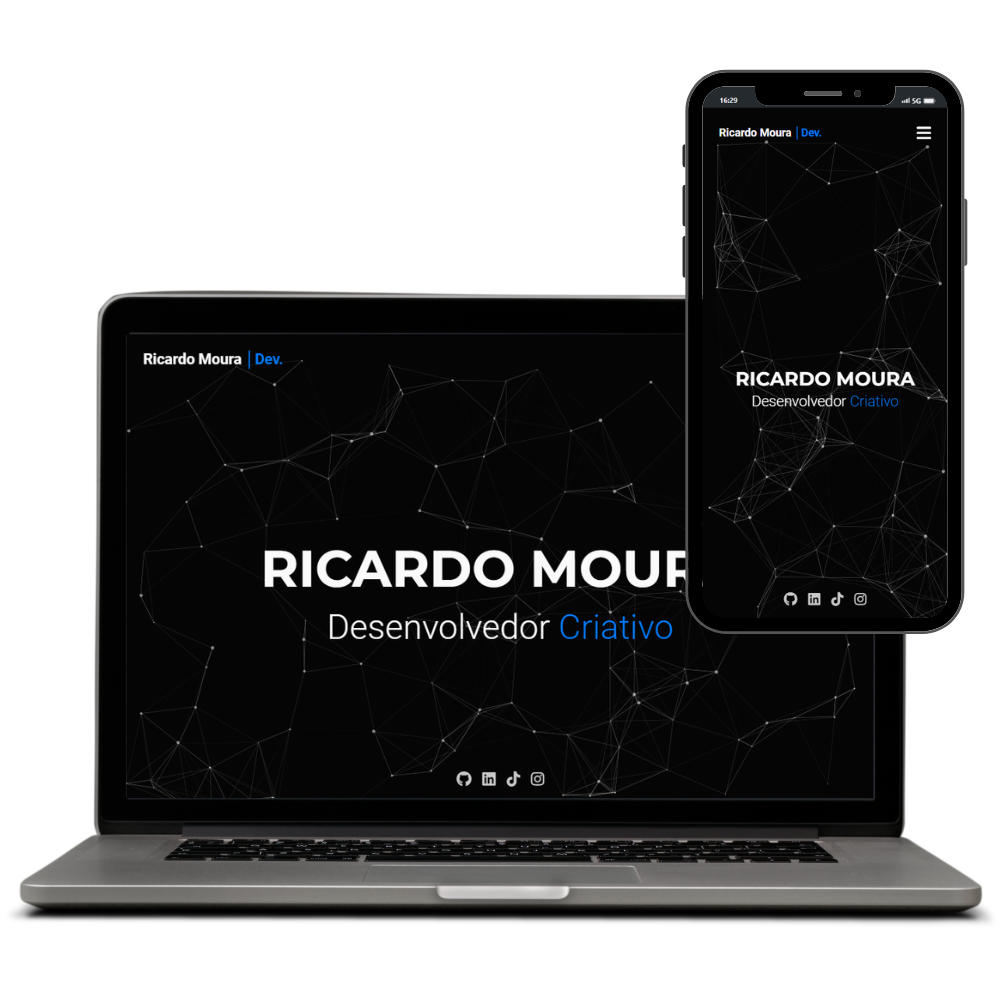

# RM Developer │ Portfolio

# Imagem do Projeto

Este repositório contém o código-fonte do meu site pessoal de portfólio, a RM Developer. É uma vitrine digital onde apresento minhas habilidades e projetos como desenvolvedor web. O site demonstra minha abordagem ao desenvolvimento web, focando em design responsivo, interatividade e experiências de usuário otimizadas.

## Tecnologias e Ferramentas

O site foi construído utilizando uma variedade de tecnologias e ferramentas modernas, destacando minha experiência e versatilidade no desenvolvimento web:

- **HTML & CSS**: Estruturação e estilização responsiva do site.
- **JavaScript**: Utilizado para criar interatividade e funcionalidades dinâmicas.
- **AOS (Animate On Scroll)**: Para animações elegantes ao rolar a página.
- **Particles.js**: Para efeitos visuais interativos em algumas seções do site.
- **FontAwesome**: Ícones estilizados e de fácil implementação.
- **EmailJS**: Integrado para facilitar o envio de emails diretamente do site.

## Características do Site

### Design e Usabilidade

- **Design Responsivo**: Totalmente adaptável a diferentes tamanhos de tela, garantindo uma experiência de usuário consistente em dispositivos móveis e desktops.
- **Animações Interativas**: Utilizando AOS e Particles.js, o site proporciona uma experiência visualmente atraente e interativa.

### Funcionalidades

- **Formulário de Contato Integrado**: Permite aos visitantes enviar mensagens diretamente através do site.
- **Botões de Acesso Rápido**: Inclui botões para WhatsApp, alternância de temas e retorno ao topo, melhorando a navegabilidade e acessibilidade.

### SEO e Performance

- **Otimizado para SEO**: Meta tags e descrições cuidadosamente escolhidas para melhorar a visibilidade do site em motores de busca.
- **Alto Desempenho**: O código foi otimizado para carregamento rápido e desempenho eficiente.

## Contribuições e Contato

Estou aberto a colaborações e feedback. Se você tiver sugestões ou quiser discutir possíveis projetos, por favor, entre em contato comigo:

- **Site**: [RM Developer](https://www.rmdeveloper.com.br)
- **Email**: [contato@rmdeveloper.com.br](mailto:contato@rmdeveloper.com.br)
- **LinkedIn**: [Ricardo Moura](https://www.linkedin.com/in/ricardomouradev/)
- **WhatsApp**: [(47) 99216-4395](https://wa.me/5547992164395)

Obrigado por visitar meu portfólio!
